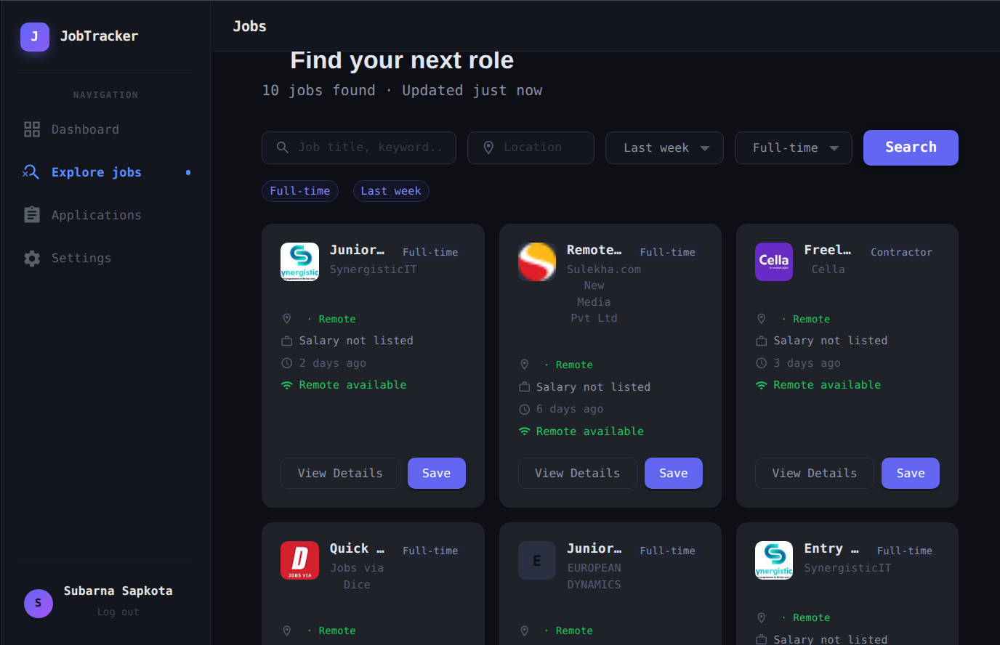
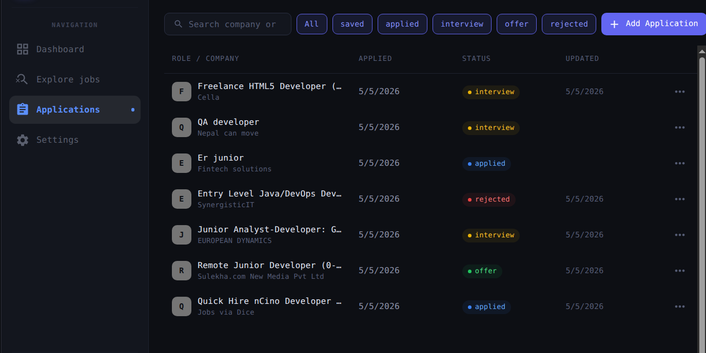
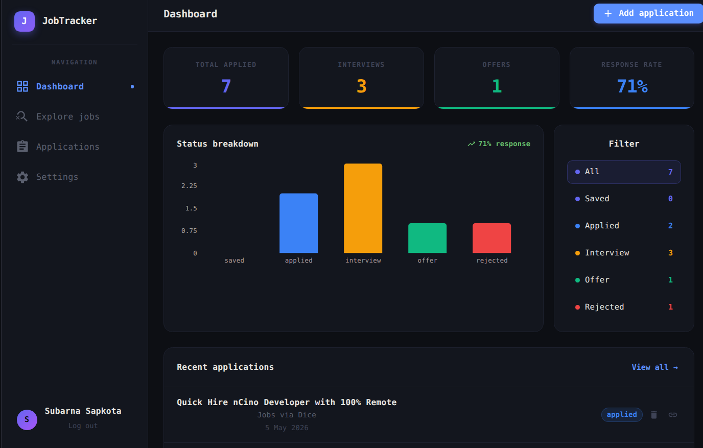
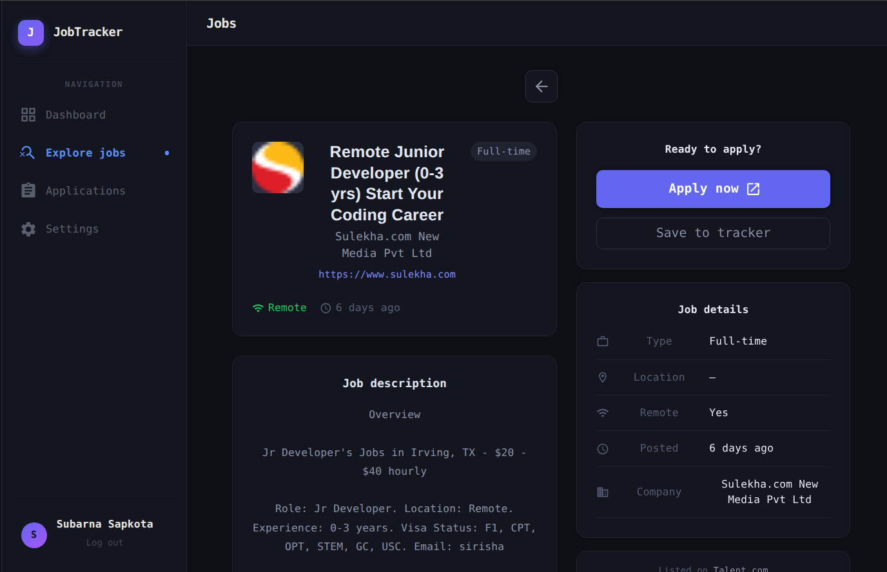

# JobTracker

A full-stack job search and application tracking app built with React, TypeScript, and Node.js. Search real job listings via the JSearch API with infinite scroll, filter by role, location, and employment type, and manually track your applications — all in one place.

**[Live Demo →](https://job-application-app-murex.vercel.app)**

---

## Features

- **Live Job Search** — Fetches real job listings from the JSearch/RapidAPI with infinite scroll
- **Filters** — Filter by role, location, remote, employment type, and date posted
- **Job Detail View** — Full job details including description, requirements, and apply links
- **Application Tracker** — Manually log and manage jobs you've applied to with status tracking
- **Dashboard** — Visual overview of your application activity with charts
- **Authentication** — Register and log in with JWT-based auth; data is private per user
- **Form Validation** — All forms validated with Zod schemas via React Hook Form

---

## Screenshots






---

## Tech Stack

### Frontend
| Tech | Purpose |
|---|---|
| React 18 + TypeScript | UI with full type safety |
| Vite | Build tool and dev server |
| MUI v9 | Component library and theming |
| React Router v7 | Client-side routing |
| React Query v5 | Server state, caching, infinite scroll (`useInfiniteQuery`) |
| Zustand | Client-side global state |
| React Hook Form + Zod | Form handling and schema validation |
| Recharts | Application analytics charts |
| Axios | HTTP client |

### Backend
| Tech | Purpose |
|---|---|
| json-server + json-server-auth | App data REST API with JWT authentication |
| server.cjs (Express) | Proxy layer for external API calls |
| RapidAPI (JSearch) | Real-time job listings data source |

### Deployment
- **Frontend** — Vercel
- **Backend** — Railway

---

## Architecture

### Feature-Based Frontend Structure

The frontend is organized by feature rather than by file type, keeping each domain self-contained:

```
src/
├── features/
│   ├── applications/       # Job search, filters, infinite scroll, job detail
│   ├── auth/             # Manual application tracking, status management
│   ├── dashboard/        # Charts and application analytics
│   └── jobs/             # Login, register, protected routes
    |__ user/              #Login, Register and settings page
├── components/           # Shared UI components
├── hooks/                # Shared custom hooks
├── store/                # Zustand global state
├── types/                # Shared TypeScript interfaces
└── lib/                  # Axios instance, zod schemas, utils
```

### Backend Split

The backend has two distinct responsibilities, kept intentionally separate:

```
┌─────────────────────┐
│   React Frontend    │
│   (Vercel)          │
└──────┬──────────────┘
       │
       ├──► json-server (Railway)
       │    Auth + app data (users, tracked applications)
       │    Handled by json-server-auth + db.json
       │
       └──► server.cjs (Railway)
            External API proxy
            /api/jobs        → JSearch (search with filters)
            /api/job-detail  → JSearch (single job)
            API key stays server-side, never reaches the client
```

**Why the split?** json-server handles the app's own CRUD and auth out of the box, while `server.cjs` exists purely as a secure proxy — keeping the RapidAPI key server-side and giving control over request shaping before it hits the external API.

---

## Infinite Scroll

Job search uses React Query's `useInfiniteQuery` to progressively load results as the user scrolls:

- Each page fetch appends to the existing list
- A scroll sentinel at the bottom triggers the next fetch automatically
- Loading and end-of-results states are handled gracefully

---

## Key Design Decisions

**Feature-based architecture** — Files are grouped by what they do, not what they are. All the logic, hooks, components, and types for job search live in `features/jobs/`. This scales better than a flat structure and makes the codebase easier to navigate as features grow.

**React Query for server state** — Handles caching, background refetching, deduplication, and infinite scroll pagination. Components stay clean without manually managing loading/error/data state.

**Zustand for client state** — Lightweight global state for UI concerns like active filters and selected job, without Redux boilerplate.

**Backend proxy pattern** — The RapidAPI key never reaches the browser. `server.cjs` validates, shapes, and forwards requests to JSearch — which is how third-party API keys are handled in production.

**Zod + React Hook Form** — Schema-first validation where the same Zod schema drives both form validation and TypeScript type inference. One source of truth.

---

## Getting Started

### Prerequisites
- Node.js 18+
- A [RapidAPI](https://rapidapi.com) account with [JSearch API](https://rapidapi.com/letscrape-6bRBa3QguO5/api/jsearch) subscribed

### 1. Clone the repo

```bash
git clone https://github.com/subarna0077/Job-application-app.git
cd Job-application-app
```

### 2. Install dependencies

```bash
npm install
```

### 3. Set up environment variables

Create a `.env` file in the root:

```env
RAPIDAPI_KEY=your_rapidapi_key_here
FRONTEND_URL=http://localhost:5173
PORT=3001
```

### 4. Run the app

```bash
# Run frontend and backend together
npm run dev:all

# Or separately
npm run dev       # Frontend on http://localhost:5173
npm run server    # Backend on http://localhost:3001
```

---

## What I'd Add Next

- [ ] Notes and interview date fields on tracked applications
- [ ] Email reminders for application follow-ups
- [ ] Migrate from json-server to PostgreSQL + Prisma for production-grade persistence

---

## License

MIT